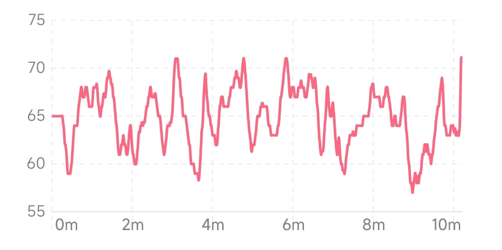
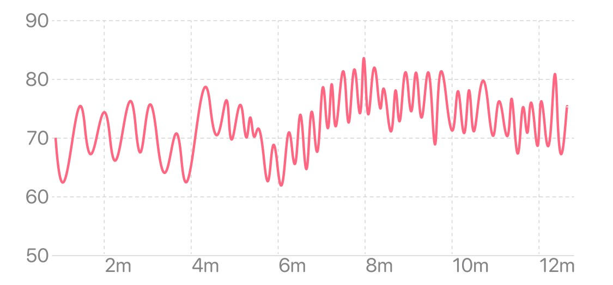

## 心率变化曲线图
心率变化曲线图反映了心率随时间的变化。横坐标为时间，纵坐标为心率水平。曲线或柱形越高表示心率水平越高。

### 当次体验视图

当次体验视图反映了当次体验过程中实时心率的变化趋势。心率与身体状态密切相关。在冥想过程中，心率的变化可能与冥想方法有关。在不同冥想方法下，心率可能表现为降低、升高或平稳的趋势。一般状态下心率的变化呈现无序性，通过放松练习和有规律的深呼吸可以使心率呈现一定的周期性节律，达到心-脑和谐的状态。

#### 典型冥想过程中的心率变化曲线（呈现无序性）

#### 冥想时心率呈现平稳的趋势

#### 冥想时心率呈现下降和升高的趋势

#### 冥想时心率呈现周期性节律

### 月视图

月视图反映了最近 1 个月心率平均水平的变化趋势，横坐标为日期。折线图中的每个点表示当天所有体验的心率平均值，背景的柱状图表示当天所有体验的心率变化范围。从月视图中可以看到心率水平短期的变化趋势。

### 年视图

年视图反映了最近 1 年心率平均水平的变化趋势，横坐标为月份。折线图中的每个点表示当月每日心率平均值的平均水平，背景的柱状图表示当月每日心率平均值的变化范围。从年视图中可以看到心率水平长期的变化趋势。