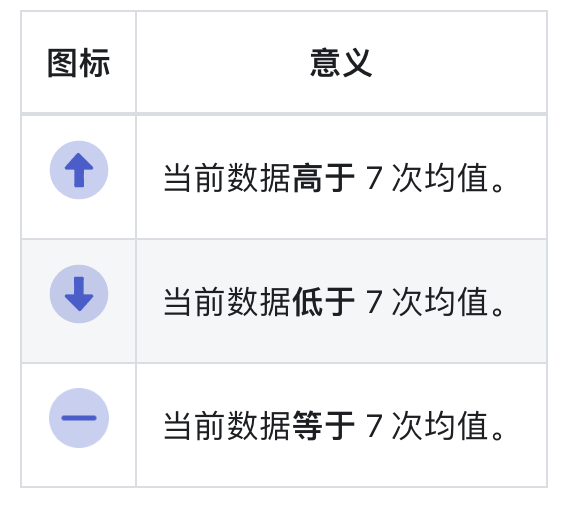
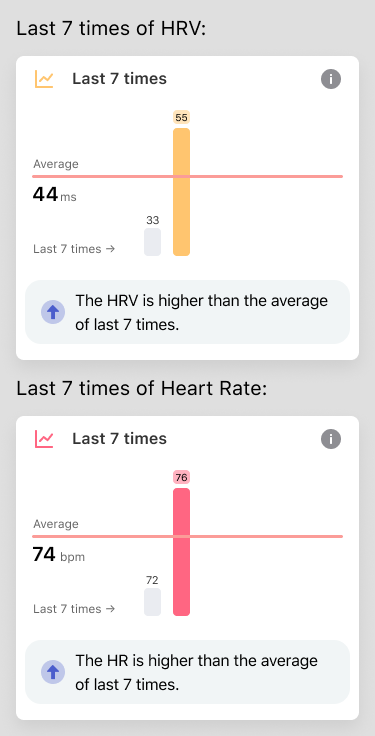
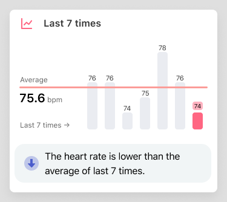

## 看懂「最近 7 次」图

最近 7 次」图表的主要目的有两个：

- 显示最近 7 次数据的变化；
- 当前数据和之前 7 次数据及 7 次数据均值的比较。

所以为了突出数据的变化和比较，我们对数据展示做了一些调整。

### 均值
图表中的横线为均值线，通过和均值线的比较来判断数据的高低。

### 数据评价
你可以通过评价中图标和评语快速判断当前数据的高低。

### 柱状图高度并非实际数值高度

最高和最低柱状图的高度是固定的。最高和最低的柱状图分别对应了数据中的最大值和最小值。

比如以下两图，最高柱状图和最低柱状图高度都是一样的，但对应的是不同数值。第一个图对应的实际 HRV 值为 33 和 45。第二个图对应的实际心率为 72 和 76。

其余柱状图会根据比例算出。比如下图，各柱状图对应的实际心率为：76，76，74，75，78，76，74。

