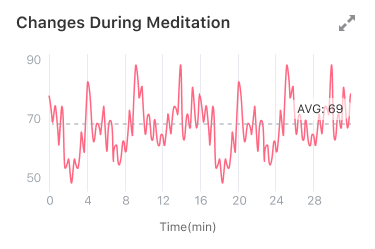
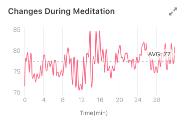
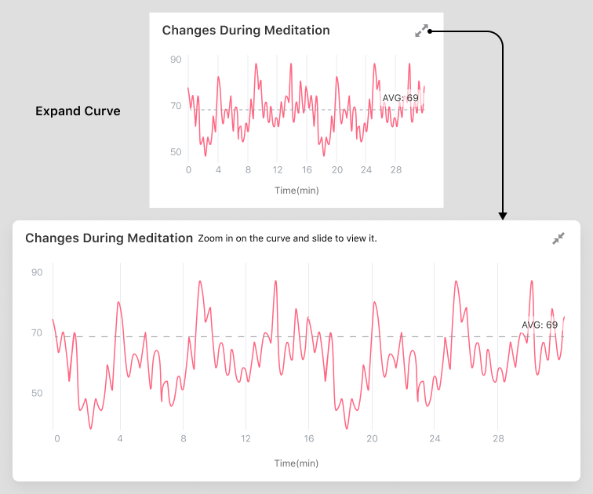

## 看懂「变化曲线」

### Y 轴/纵坐标
为了凸显出使用过程中的数值变化，心率、心率变异性和压力水平的纵坐标为动态纵坐标。这意味着如果你两次使用过程中的最大和最小值不一样，那么 Y 轴/纵坐标也会不一样。比如下图，图 1 - Y 轴的范围为50 ~ 90，图 2 - Y 轴的范围为 70~85。

图1

图2

### 放大曲线图并查看
点击曲线图右上角的展开按钮，曲线图会横屏展开。这是你可以通过双指进行图标缩放，并拖动查看细节。

### 数值
使用时间越长，产生的数据会越多。当数据较多时，曲线图在未展开状态时，显示空间较小。此时数据会重叠，难以显示。所以未展开的曲线图会选取部分数据进行显示，主要突出整体的变化。

展开后的曲线图会显示所有数据。如果你需要查看曲线图的细节，可以将展开后曲线图放大并滑动查看。

### 均值线和均值

我们在曲线图上画了一条均值线，并标注了均值。你可以通过对比曲线的值和均值，来衡量值的高低。
