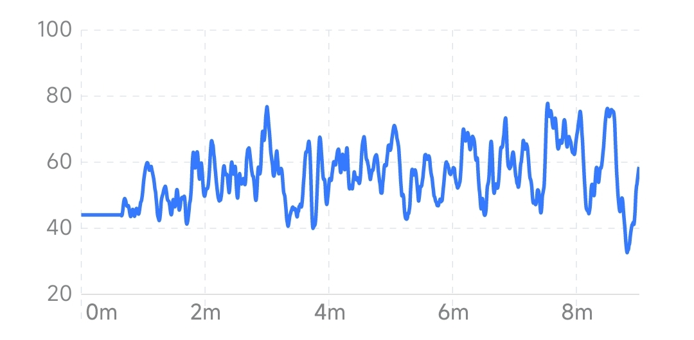

## 放松度变化趋势图

放松度变化趋势图反映了放松度随时间的变化。横坐标为时间，纵坐标为放松度水平。曲线或柱形越高表示越放松。

### 当次体验视图

当次体验视图反映了当次体验过程中实时放松度的变化趋势。大多数类型的冥想与放松有关。一般在闭眼放松时，放松度会提高。经过长期训练的人士在冥想中可以使放松度达到很高水平并维持较长时间。在一些需要专注的冥想中，放松度可能较低。

#### 典型的闭眼放松时放松度的变化

#### 有经验的冥想者放松度的变化

#### 以专注为主的冥想过程中放松度的变化

### 月视图

月视图反映了最近 1 个月放松度平均水平的变化趋势，横坐标为日期。柱状图中每个柱形的高度表示当天所有体验的放松度平均值。从月视图中可以看到放松度水平短期的变化趋势。

### 年视图

年视图反映了最近 1 年放松度平均水平的变化趋势，横坐标为月份。柱状图中每个柱形的高度表示当月每日放松度平均值的平均水平。从年视图中可以看到放松度水平长期的变化趋势。