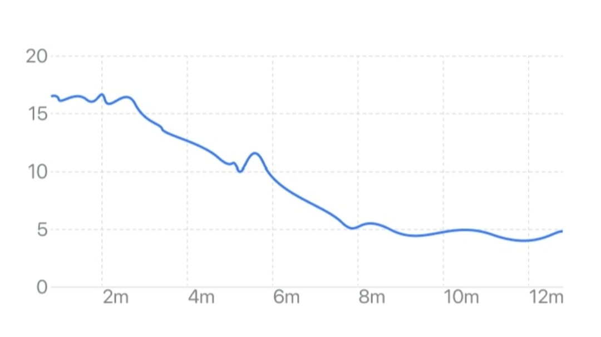
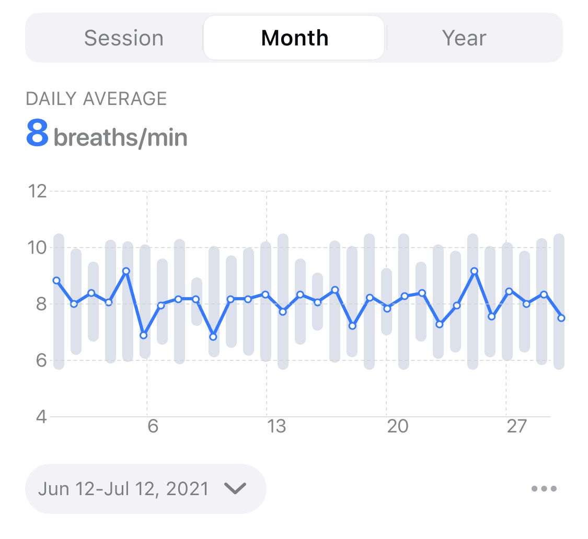
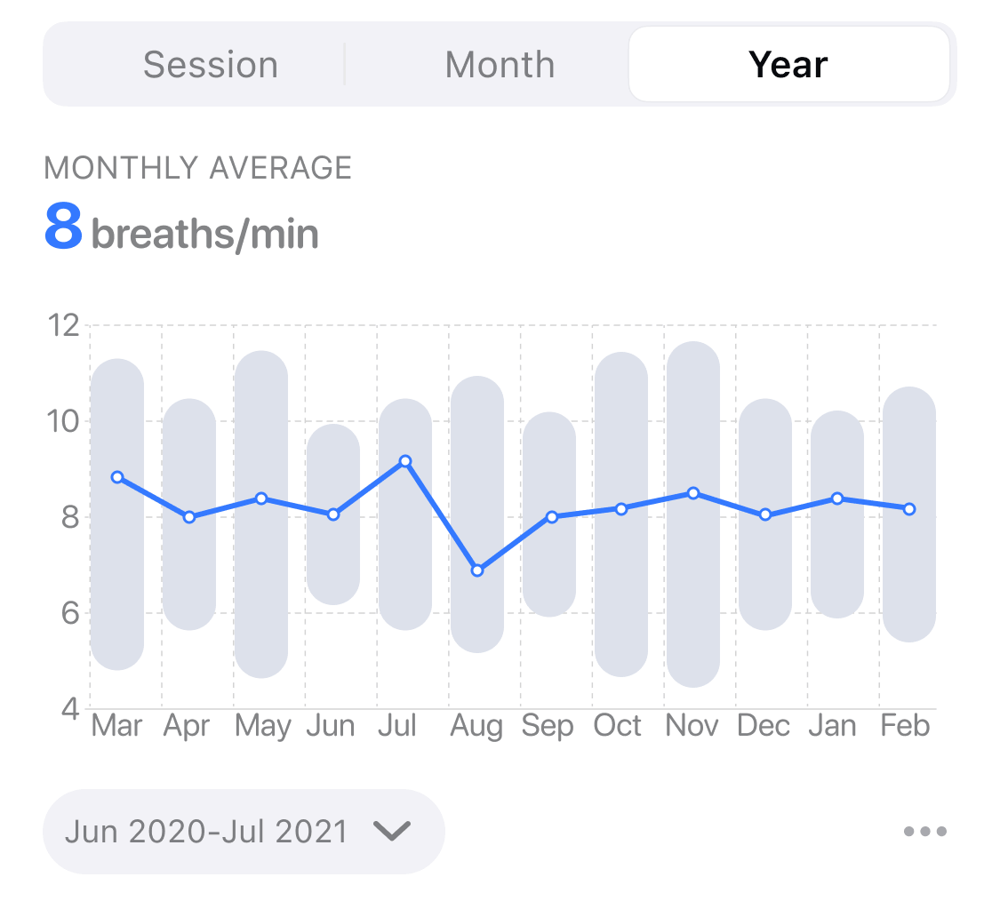

## 呼吸率变化曲线图

呼吸率变化曲线图反映了呼吸率随时间的变化。横坐标为时间，纵坐标为呼吸率。曲线或柱形越高表示呼吸率越高。

### 当次体验视图

当次体验视图反映了当次体验过程中实时呼吸率的变化趋势。呼吸率可以反映冥想过程中的呼吸情况。自然呼吸的状态下呼吸率较高，一般为 12-20 次/分，而在冥想过程中，尤其是有规律的深呼吸状态下，可以看到呼吸率明显降低。共振呼吸时，呼吸率为 6 次/分左右，可达到和谐状态。

#### 冥想状态下的呼吸率变化曲线（从自然呼吸道共振呼吸）

### 月视图

月视图反映了最近 1 个月呼吸率平均水平的变化趋势，横坐标为日期。折线图中的每个点表示当天所有体验的呼吸率平均值，背景的柱状图表示当天所有体验的呼吸率变化范围。从月视图中可以看到呼吸率短期的变化趋势。

### 年视图

年视图反映了最近 1 年呼吸率平均水平的变化趋势，横坐标为月份。折线图中的每个点表示当月每日呼吸率平均值的平均水平，背景的柱状图表示当月每日心率平均值的变化范围。从年视图中可以看到呼吸率长期的变化趋势。

