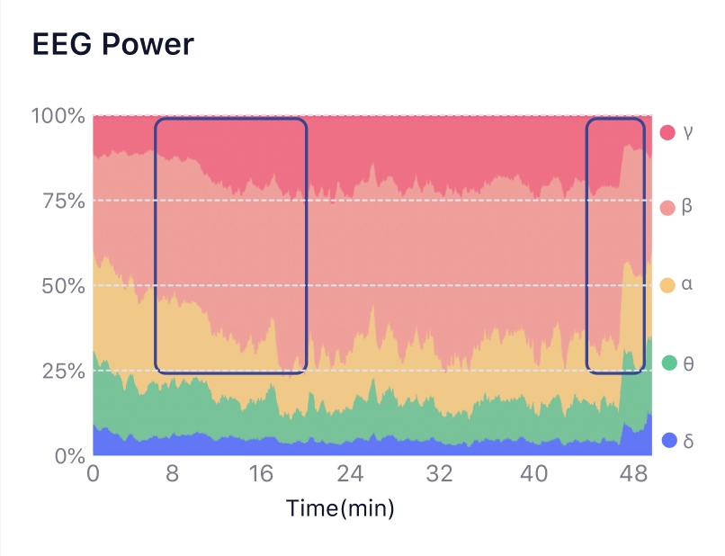
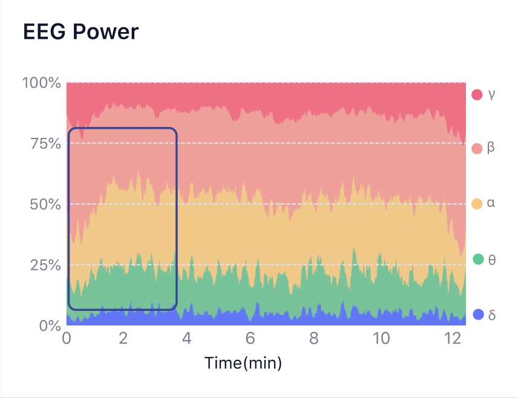

# 📊如何看脑电波节律趋势图？

关于脑电波节律，请查看[🔋脑电波节律（Brainwave Rhythms）](./名词解释/脑电波节律（Brainwave Rhythms）.html)。

脑电波节律的变化趋势体现了冥想过程中精神状态的变化。

| 名称 | 冥想状态 |
| :---: | :---: |
| γ波 | 资深经验的冥想人士在冥想过程中该频段可能出现较高能量 |
| β波 | 冥想过程中，在专注度较高时该频段能量较高 |
| α波 | 冥想过程中，由于闭眼和放松，该频段能量会比平时有所增加 |
| θ波 | 具有一定冥想经验的人在冥想过程中可以出现较高的θ波，但同时又保持清醒 |
| δ波 | 冥想过程中一般没有太大变化 |

## 典型冥想状态下的脑电波节律比例

## 典型冥想状态下的脑电波节律比例

